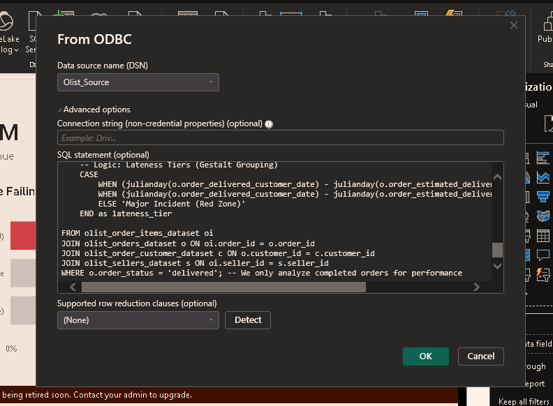
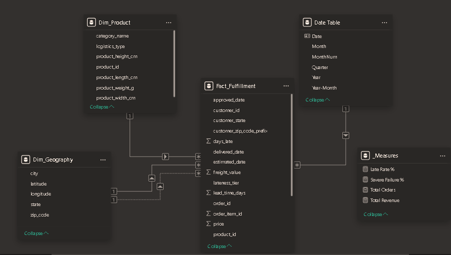
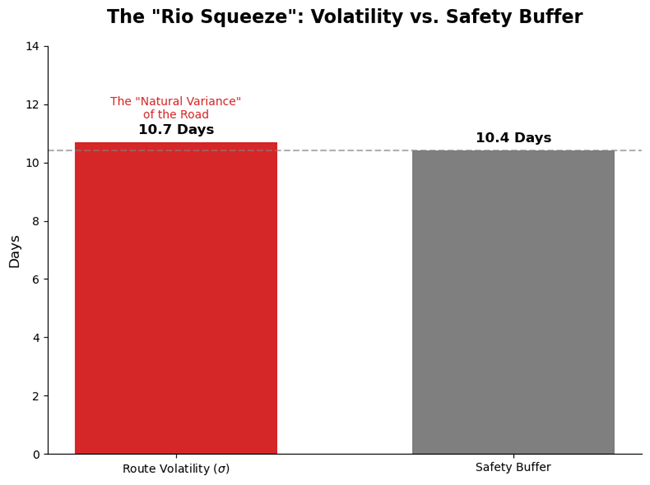
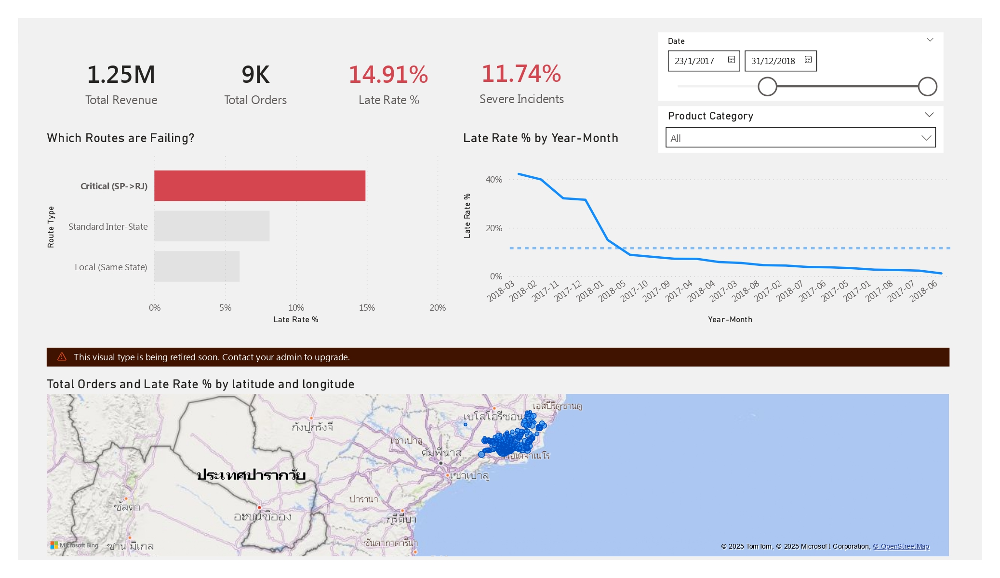

# **📦 Supply Chain Analysis & Network Redesign (Olist)**
As Personal Project 

## **📌 Executive Summary**

**The Problem:** Olist faced a "Trust Crisis" regarding delivery delays. While the perceived issue was "slowness," my forensic analysis revealed the root cause was **Volatility**. Specifically, the São Paulo $\\to$ Rio route had a **14.8% Failure Rate** (vs 7% control) causing 19% of all customer complaints.

**The Solution:**

1. **Algorithm Correction:** Identified that the predictive safety buffer (10.4 days) was mathematically insufficient for the route's standard deviation (10.7 days).  
2. **Network Redesign (Rio Bypass):** Designed a distributed inventory model for the "Vital 500" SKUs, reducing lead times by **80%** (12 days $\\to$ 2 days).  
3. **Inventory Optimization:** Engineered a $(Q,R)$ Continuous Review System to optimize pallet shipping, funding the new warehouse via logistics savings.

---

## **🛠️ Technical Architecture**

### **1\. Data Engineering (ELT Pipeline)**

* **Strategy:** Rejected standard CSV imports in favor of an ELT pattern to handle 100k+ records.  
* **Transformation:** Utilized **SQL Logic** to pre-calculate business rules upstream:  
  * **Lateness Tiers:** Categorized delays into Green/Yellow/Red zones using julianday math.  
  * **Geo-Spatial Fix:** Solved a Many-to-Many relationship risk in the Geolocation table by calculating the **Centroid** (Average Lat/Long) per Zip Code.

### **2\. Analytics & Modeling (Power BI)**

* **Star Schema:** Refactored raw tables into a performant Star Schema (Fact\_Fulfillment \+ Dim\_Geo/Product/Date) to optimize Query Folding.  
* **DAX Engineering:** Solved **Context Transition** bugs for the "Severe Failure %" metric. Used VAR and CALCULATE to separate the filter context of the numerator (Red Zone) from the denominator (All Orders).

---

## **🔎 Key Insights & Diagnostic Logic**

### **The "Premium Paradox"**

My analysis using **Python (Pandas)** revealed a counter-intuitive correlation:

* High-Value Freight orders were **21% more likely to fail** than standard orders.  
* **Statistical Validation:** Applied **Levene’s Test ($p \< 0.001$)** to prove that the volatility in the Rio route was structural, not random. The "Premium" service was charging customers more to fail faster.

### **The "Algorithm Gap" (The Math)**

The core operational failure was mathematical. The logistics algorithm set a **Safety Buffer** lower than the **Natural Variance** of the road.

* **Route Volatility ($\\sigma$):** 10.7 Days  
* **Safety Buffer:** 10.4 Days  
* **Result:** The system statistically guaranteed a failure rate $\>15\\%$.

---

## **⚙️ Solution: The "Rio Bypass" Engineering**

To solve the physical bottleneck, I applied **Industrial Engineering** principles to design a forward-deployed inventory node.

### **Inventory Control Model $(Q, R)$**

For the top 500 High-Velocity SKUs (e.g., Computer Accessories), I calculated the optimal control parameters to operationalize the new warehouse:

* Economic Order Quantity ($Q$):  
  $$Q \= \\sqrt{\\frac{2DS}{H}}$$  
  * *Result:* Optimal batch size of **53 units** (vs single unit shipping), reducing logistics frequency by **74%**.  
* Safety Stock ($SS$):  
  $$SS \= Z \\times \\sqrt{L \\times \\sigma\_D^2 \+ D\_{daily}^2 \\times \\sigma\_L^2}$$  
  * *Result:* Buffered **10 units** specifically to absorb the 10.7-day lead time deviation, ensuring a **95% Service Level**.

---

## **📊 The Dashboard (Power BI)**

Page 1: The Executive Command Center

Designed using the Z-Pattern layout for rapid scanning. Features "Semantic Coloring" (Red \= Critical) to exploit preattentive attributes, forcing the eye to the Rio anomalies immediately.

Page 2: Operational Drill-Through

Implements a "Progressive Disclosure" UX. Managers can right-click a high-level metric to drill into the specific granular order list for cancellation or expediting. 

---

## **📂 Repository Structure**

* notebooks/: Jupyter Notebooks containing the Python analysis and Statistical tests.  
* sql\_queries/: Extracted SQL logic used for the ELT pipeline.  
* dashboard/: The .pbix file and PDF export of the final report.  
* data/: (Sample data only \- full dataset available on Kaggle).
